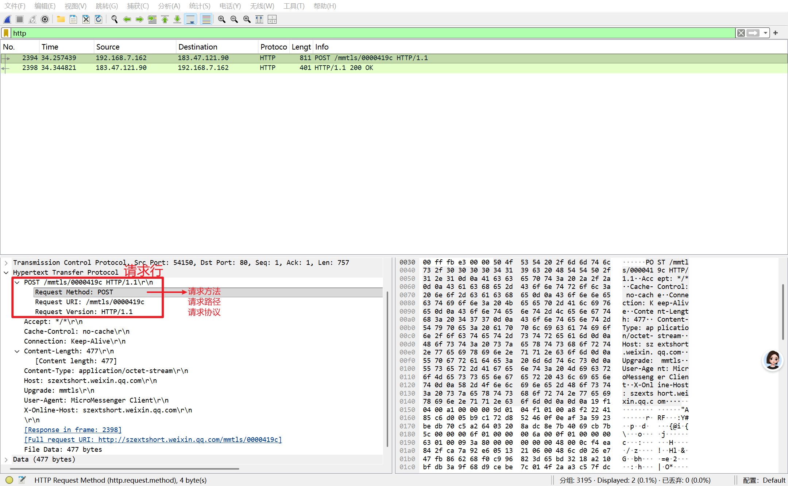

## Day32——HTTP协议

1. HTTP中文全称及其全称的每个字段含义

   1. 超文本传输协议
   2. 全称的每个字段
      - 超文本：可以传送文本、图片、音频、视频、页面等非线性、网状的信息资源
      - 传输：在客户端与服务器之间，完成数据的请求-响应式传递
      - 协议：计算机之间通信的约定和标准

2. URL由哪些部分组成

   1. 协议

   2. 域名/IP

   3. 端口

      ----------------------

      服务器内部路径：

   4. 虚拟目录

   5. 文件名

   6. 锚

      ------------------------

   7. 参数

3. HTTP请求报文和响应报文由哪些部分组成

   1. **HTTP请求报文**

      1. **请求行**

         - **请求方法**：以何种请求方法向当前的地址发起请求，常见的请求方法有**GET和POST**两种，GET主要用来进行**查询数据**，POST主要用来进行**提交数据**，这才是GET和POST本质上的区别。

           > 除了GET和POST以外的请求方法
           > PUT请求: 上传资源/数据
           > DELETE请求: 删除资源/数据
           > HEAD请求: 获取相应头信息
           > OPTIONS请求: 获取请求方式/测试链接

         - **请求资源**：访问两个不同页面时，主要的区别在于请求资源不同，它是一个给目标服务器的重要标识。URL 是请求资源的**目标和依据**，请求资源是使用 URL 的**目的**。

         - **请求协议**：目前HTTP协议的版本是HTTP/1.1，之前的一个版本是HTTP/1.0。1.0和1.1之间最大的区别在于是否支持长连接。长连接就是在一个TCP连接内发送多个HTTP请求。HTTP/1.1默认支持长连接；HTTP/1.0不支持长连接。所以1.1相较于1.0，网络访问速度会有明显提升。

      2. **请求头**：HTTP请求的客户端要告诉服务端的一些请求信息

      3. **空行**：仅做标识使用，用于隔开请求头和请求体

      4. **请求正文/请求体**：请求体中一般用来传输客户端需要传递给服务器的数据信息等

   2. **HTTP响应报文**

      1. **响应行**

         - **协议版本**：标识所使用的 HTTP 协议版本，例如：HTTP/1.1

         - **状态码**：一个三位数字，表示请求的处理结果

           > 100段：表示接收的请求正在处理，现在处于废弃状态；
           >
           > 200段：表示请求成功/正常；
           >
           > 300段：重定向（重新指定到一个新的地址，比如：http://bing.com）;
           >
           > 400段：表示请求包含语法错误或无法完成，也说明服务器资源不存在(但是服务器是存在的);
           >
           > 500段：服务器异常，服务器在处理请求的过程中发生了错误；

         - **原因短语**：对状态码的简短文本描述，成功或者失败(不重要,从语法上可以随意写) 

      2. **响应头**：用来说明客户端要使用的一些附加信息

      3. **空行**：标识使用

      4. **响应正文/响应体**：可以是文本数据也可以是二进制类型数据，其中响应头中Content-Type指示了该资源的类型，比如文本类型资源时，Content-Type为：text/html；图片资源时Content-Type为：image/png；Content-Length指示了响应体的长度。

4. HTTP常用方法有哪些

   **GET**：主要用来进行查询数据

   **POST**：主要用来进行提交数据

5. HTTP常用状态码有哪些

   200段：表示请求成功/正常；

   400段：表示请求包含语法错误或无法完成，也说明服务器资源不存在(但是服务器是存在的);

   500段：服务器异常，服务器在处理请求的过程中发生了错误；

6. **抓包一个HTTP请求**

