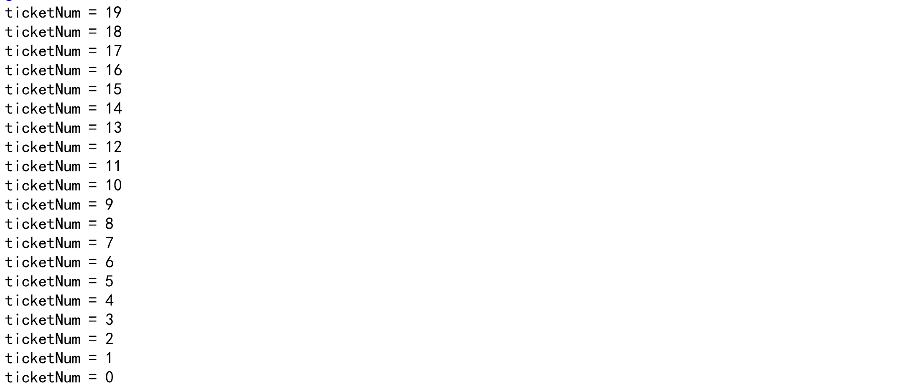
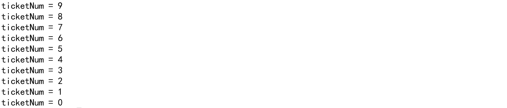
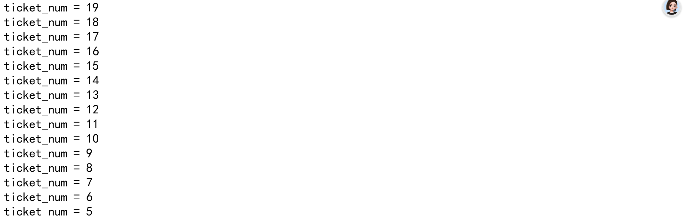
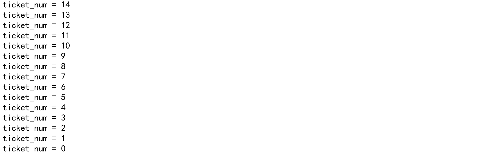

# 售票程序的两种实现方式

## 1.纯互斥锁

### 源代码

```c
#include <my_header.h>

typedef struct share_state
{
    int flag; // 0: 未加票, 1已加票
    int ticketNum;
    pthread_mutex_t mLock;
} share_state_t;

void *sellFun(void *arg)
{
    share_state_t *pShareState = (share_state_t *)arg;

    while(1)
    {
        pthread_mutex_lock(&pShareState->mLock);

        if(pShareState->ticketNum <= 0 && pShareState->flag == 1)
        {
            pthread_mutex_unlock(&pShareState->mLock);
            break;
        }

        struct timeval nowTime;
        gettimeofday(&nowTime, NULL);
        srand((unsigned int) nowTime.tv_usec );
        double rand_num = (double)rand()/RAND_MAX;

        if(pShareState->ticketNum > 0 && rand_num < 0.1)
        {
            pShareState->ticketNum--;
            printf("ticketNum = %d \n", pShareState->ticketNum);
        }
        pthread_mutex_unlock(&pShareState->mLock);
    }
    pthread_exit(NULL);
}

void *purchaseFun(void *arg)
{
    share_state_t *pShareState = (share_state_t *)arg;

    while(1)
    {
        pthread_mutex_lock(&pShareState->mLock);

        if(pShareState->ticketNum <= 5)
        {
            pShareState->ticketNum = pShareState->ticketNum + 10;
            pShareState->flag = 1;
            pthread_mutex_unlock(&pShareState->mLock);
            break;
        }

        pthread_mutex_unlock(&pShareState->mLock);
    }
    pthread_exit(NULL);
}

int main(int argc,char* argv[])
{
    share_state_t shareState;
    shareState.ticketNum = 20;
    shareState.flag = 0;
    pthread_mutex_init(&shareState.mLock, NULL);

    pthread_t pid1, pid2;
    pthread_create(&pid2,NULL,purchaseFun,&shareState);
    pthread_create(&pid1,NULL,sellFun,&shareState);

    pthread_join(pid1, NULL);
    pthread_join(pid2, NULL);
    return 0;
}
```

### 实现效果





## 2.条件变量（必须配合互斥锁）

### 源代码

```c
#include <my_header.h>
/*
此程序巧妙地仅使用一个条件变量就实现了卖票sell与补票supply之间的同步
*/
typedef struct share_state{
    int ticket_num;
    int flag; // 0-还未补票，1-已经补票
    pthread_mutex_t mutex;
    pthread_cond_t cond;
}share_state_t;

void* sell_func(void* arg){ // 卖票-减少票，所以对应消费者-wait
    share_state_t* p_share_state = (share_state_t*)arg;

    while(1){
        pthread_mutex_lock(&p_share_state->mutex);

        if(p_share_state->ticket_num <= 0 && p_share_state->flag == 1){
            pthread_mutex_unlock(&p_share_state->mutex); // 票都没了且已经补票，所以无法继续卖票即终止线程
            break;
        }

        struct timeval now_time;
        gettimeofday(&now_time, NULL);
        srand((unsigned int)now_time.tv_usec);
        double rand_num = (double)rand() / RAND_MAX; // 把随机数映射到[0.0, 1.0]浮点数区间
                                                     // RAND_MAX：标准库宏定义，rand()函数能返回的最大整数值，绝大多数系统中RAND_MAX = 32767（即2^15 - 1）

        if(p_share_state->ticket_num > 0 && rand_num < 0.1){ // 只有票数>0且随机数<0.1(即每一次买票的人只有10%概率才买)时，才卖出1张票
            p_share_state->ticket_num--;
            printf("ticket_num = %d\n", p_share_state->ticket_num);
        }

        if(p_share_state->ticket_num <= 5 && p_share_state->flag == 0){
            pthread_cond_signal(&p_share_state->cond);
            pthread_cond_wait(&p_share_state->cond, &p_share_state->mutex); // 唤醒对方的同时立刻自我阻塞，然后等着对方完成之后唤醒自己
        }

        pthread_mutex_unlock(&p_share_state->mutex);
    }

    pthread_exit(NULL);
}


void* supply_func(void* arg){ // 补票-增加票，所以对应生产者-signal
    share_state_t* p_share_state = (share_state_t*)arg;
    // 补票的总过程只有一次，所以在补票线程这里并没有无限循环while(1)
    pthread_mutex_lock(&p_share_state->mutex);

    if(p_share_state->ticket_num > 5){ // 若是补票线程抢到CPU运行时不满足补票条件，则先自我阻塞并释放锁，等待条件满足时即被唤醒时直接补票
        pthread_cond_wait(&p_share_state->cond, &p_share_state->mutex);
        p_share_state->ticket_num += 10;
        p_share_state->flag = 1;
    }else{ // 若是补票线程一上来就满足补票条件，则直接补票，从而线程直接结束
        p_share_state->ticket_num += 10;
        p_share_state->flag = 1;
    } // 注意，这里的if-else都是对应要补票，只不过情况不一样而且，也就是说if-else分支只有一个能执行，但执行效果相同
    pthread_cond_signal(&p_share_state->cond);

    pthread_mutex_unlock(&p_share_state->mutex);

    pthread_exit(NULL);
}

int main(int argc, char* argv[]){
    share_state_t share_state;
    share_state.ticket_num = 20; // 初始时票数为20
    share_state.flag = 0; // 初始时还未补票
    pthread_mutex_init(&share_state.mutex, NULL);
    pthread_cond_init(&share_state.cond, NULL);

    pthread_t sell_id, supply_id;
    pthread_create(&sell_id, NULL, sell_func, (void*)&share_state);
    pthread_create(&supply_id, NULL, supply_func, (void*)&share_state);

    pthread_join(sell_id, NULL);
    pthread_join(supply_id, NULL);
    return 0;
}
```

### 实现效果





## 对比总结

**从实现效果来看：**

​		互斥锁中：即使补票线程先抢到CPU，但是由于不满足补票条件，所以也只能放弃CPU，但是这一放弃CPU就不会再主动抢到了，而卖票线程抢到CPU之后会一直执行到将票卖完之后主动放弃CPU，在这时补票线程才能抢到CPU。

​		条件变量中：而在条件变量中，由于存在阻塞、唤醒操作，只要条件不满足补票线程就会主动阻塞，而当补票条件满足时，卖票线程会优先直接唤醒补票线程，而不是一直抢占CPU到票卖完为止。

## **补充：为什么纯互斥锁版本中补票线程抢不过卖票线程？**

1. **锁释放后，下一个抢到锁的几乎永远是卖票线程**

​	在你这个代码里：

- 卖票线程**解锁后立刻又抢锁**（循环内无任何阻塞、休眠）
- 补票线程**解锁后也立刻抢锁**

​	==Linux 系统的**互斥锁是 “公平性很差” 的**，谁离锁最近、谁刚释放锁，谁就**极高概率**再次抢到锁。==

​	**结果就是：卖票线程一直 “自己抢自己的锁”，补票线程根本插不进去。**

2. **补票线程是 “空跑循环”，没有任何阻塞**

```c
// 补票线程空转
while(1) {
    加锁
    不满足条件
    解锁
}
```

​	这叫**忙等待（busy waiting）**，**完全不放弃 CPU**，但也**完全做不了正事**。

​	但它**抢不过卖票线程**，因为卖票线程循环更紧凑、系统调度偏向它。

3. **只有卖票线程退出循环、不再抢锁，补票线程才能抢到**

​	卖票线程的退出条件：

```c
if(票数<=0 && 已补票) {
    解锁
    break;  // 不再抢锁！
}
```

​	**只有卖票线程彻底停止抢锁了**，锁才会空闲，补票线程才能第一次真正稳定抢到锁。